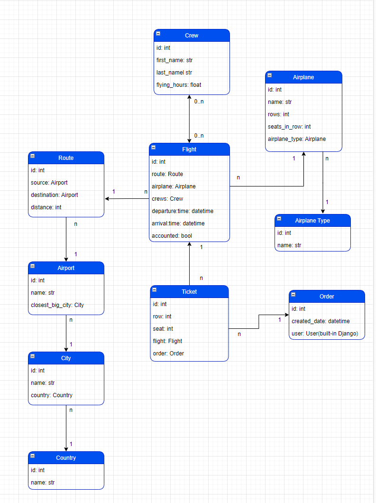
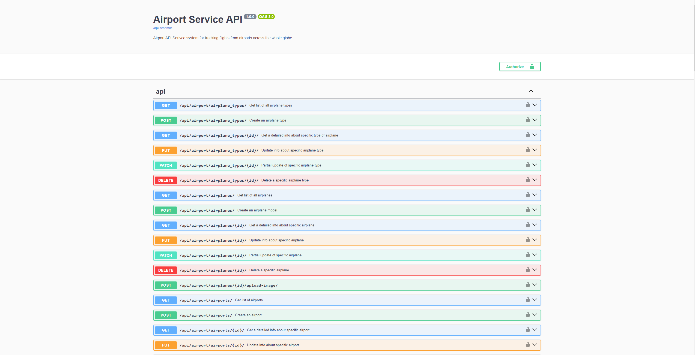
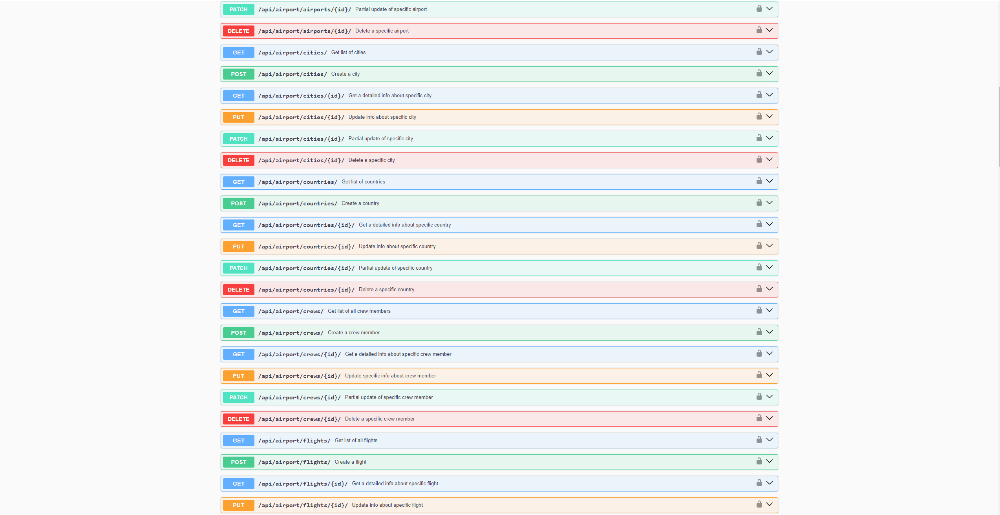
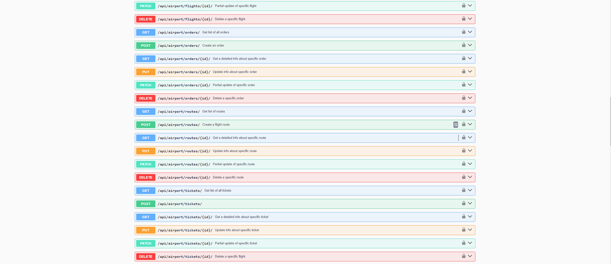
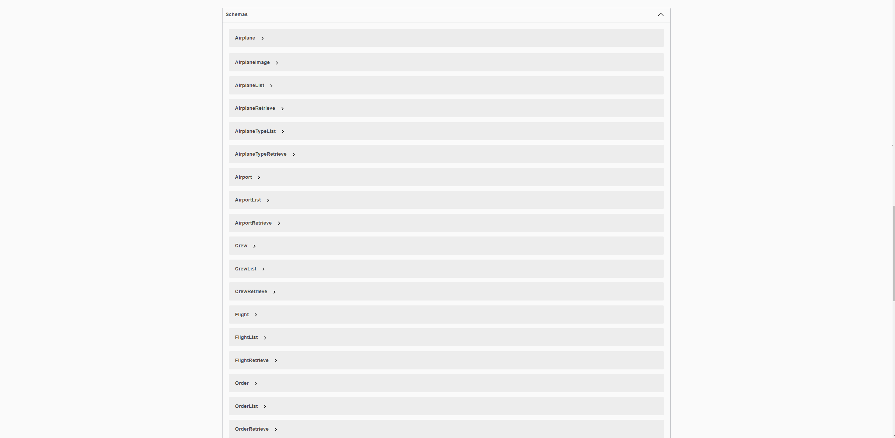

# Airport Service

### About project:

This is the Airport API service system for tracking direct flights from airports across the whole globe.

### Technologies that were included to this project:

1. **Django REST Framework**: For managing API views.
2. **PostgreSQL**: As the main database.
3. **Celery**: For updating flying hours for every crew member(pilots and flight attendants) who was on a flight.
4. **Redis**: As the Celery broker.
5. **Docker Compose**: For developing the microservices.
6. **Swagger**: For API documentation.

### Airport Service Features

* JWT authentication.
* Admin panel /admin/.
* Recording information about countries and cities, associating airports with their closest big city.
* Creating and managing routes (based on airports).
* Creating and managing airplanes and airplane types.
* Creating and managing crews.
* Creating and managing flights.
* Different types of filtering.
* The ability to upload airplanes images to represent a specific kind of airplane.
* Recording and managing orders made by users, and handle tickets for specific flights and orders, including row and seat details.

### How to run:
#### Using Docker

- Copy .env.sample -> .env and fill with all required data
- `docker-compose up --build`
- Load db data from file (Optional)
- `docker-compose exec -ti airport python manage.py loaddata airport_service_db_data.json`
- Create admin user (Optional)
- `docker-compose exec -ti airport python manage.py createsuperuser`

#### Using GitHub
```bash
git clone https://github.com/mwellick/airport-api-service.git
cd airport-api-service/airport_service
python -m venv venv
source venv/bin/activate
pip install -r requirements.txt

# Apply migrations and run the server
python manage.py migrate
python manage.py runserver
python manage.py loaddata airport_service_db_data.json
```

### Test admin user:

**email:** `admin@admin.com`  
**password:** `Ellipsis`

### Test default user:

**email**: `qwe@qwerty.com`  
**password**: `Qwerty123`
## DB Structure






## Copyright
Copyright (c) 2024 Michael Korotia
