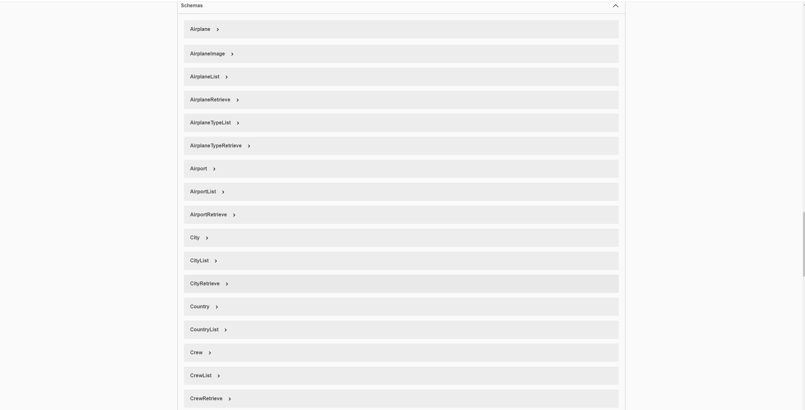
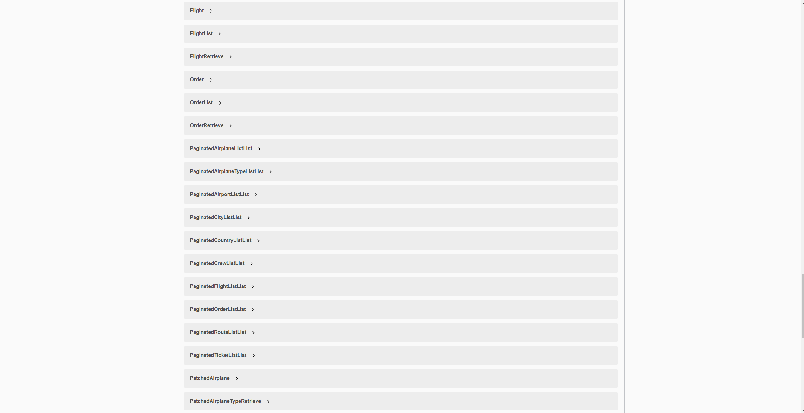

# Airport Service

### About project:

This is the Airport API service system for tracking direct flights from airports across the whole globe.

### Technologies that were included to this project:

1. **Django REST Framework**: For managing API views.
2. **PostgreSQL**: As the main database.
3. **Celery**: For updating flying hours for every crew member(pilots and flight attendants) who was on a flight.
4. **Redis**: As the Celery broker.
5. **Docker Compose**: For developing the microservices.
6. **Swagger**: For API documentation.

### Airport Service Features

* JWT authentication
* Admin panel /admin/
* Managing orders and tickets
* Creating routes (based on airports)
* Creating airplanes and airplane types
* Creating crews
* Creating flights.
* Different types of filtering
* The ability to upload airplanes images to represent a specific kind of airplane

### How to run:

- Copy .env.sample -> .env and fill with all required data
- `docker-compose up --build`
- Load db data from file (Optional)
- `docker-compose exec -ti api python manage.py loaddata airport_service_db_data.json`
- Create admin user (Optional)
- `docker-compose exec -ti airport python manage.py createsuperuser`

### Test admin user:

**email:** `admin@admin.com`  
**password:** `Ellipsis`

### Test default user:

**email**: `qwe@qwerty.com`  
**password**: `Qwerty123`

